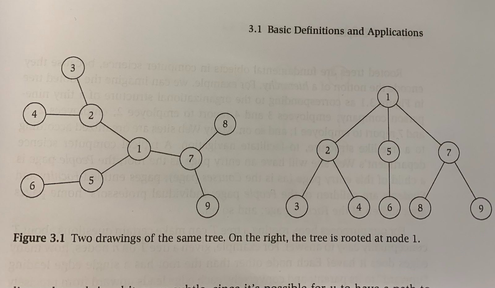
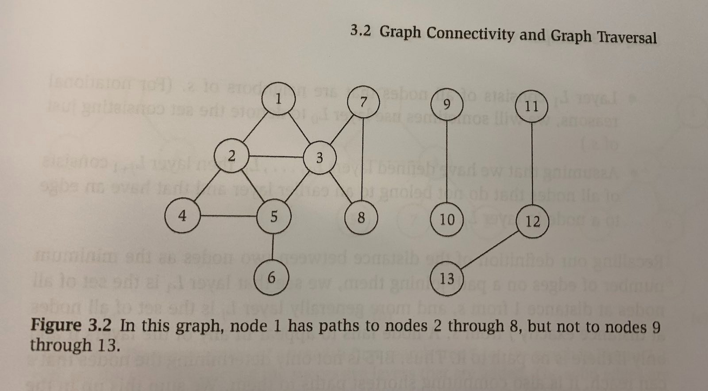

# BFS Datasets

The BFS Datasets are broken down into toy size (here), and small, medium and large (external).

## Toy Dataset

The toy graphs are taken from the book [Kleinberg & Tardos, *Algorithm Design* (2014)](https://www.amazon.com/Algorithm-Design-Kleinberg-Tardos-Paperback/dp/B00NYJA5X6)

the **.in** files consist of the adjacency lists for each graph. They assume a directed graph.

Their format is 

	#Title
	#Source
	NODES
	1
	2
	..
	n
	EDGES
	(1,2)
	(2,3)
	...
	(m,n)

The **.out** files consist of the parameters and results expected for a BFS. They have multiple test cases. The files are laid out as: 

	#title
	source: <startNode>
	target: <node being searched for>
	traversal 1,2,3,4,...n

Note, we should expect the program to return FAIL as the final traversal if the it does not find the search target. 

### toyTree

### toyHard

